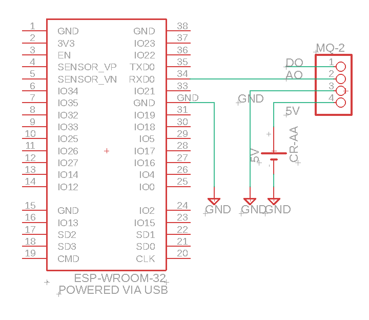
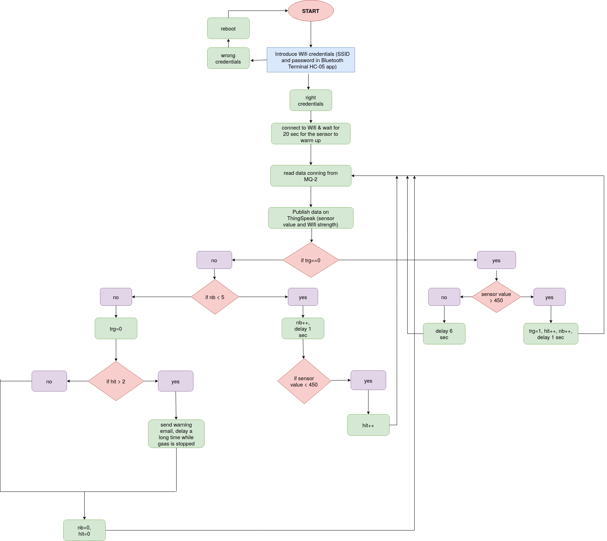
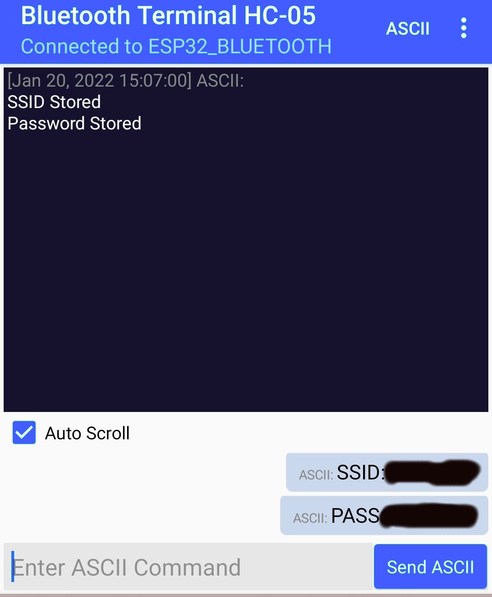
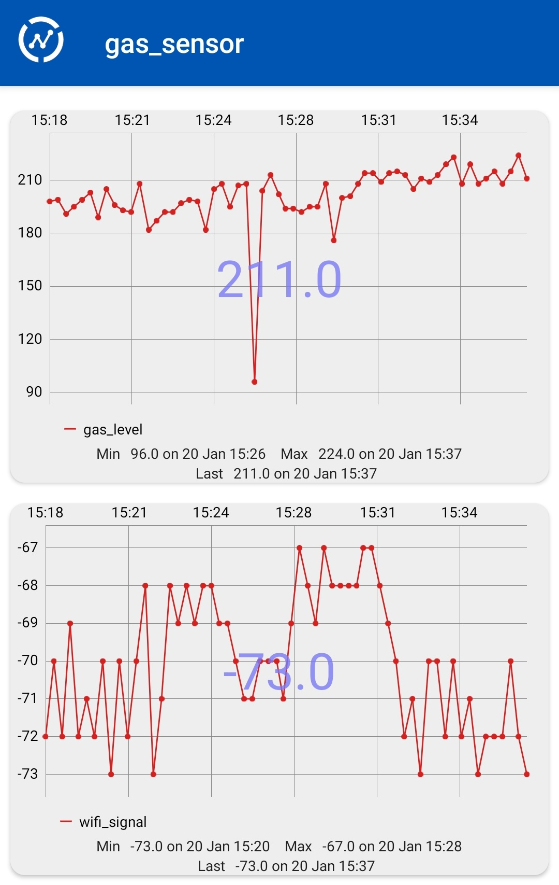

## Smoke/ Gas detector
### Prerequisites
* Thingspeak library that can be easily installed from *Library Manager* in Arduino IDE
* To compile the script without errors go to Tools -> Partition Scheme and set it to Huge. The schetch contains multiple lines and it uses a lot of program storage space. 
### Description
This project aims to develop a Smoke/Combustible Gas detector using ESP32 and MQ-2 sensor. ThingSpeak provides data ingestion and storage for the sensor, with the possibility to build Matlab algorithms to make the system smarter. When a certain threshold is exceeded ESP32 sends an alert email to signal the owner of the building/apartment that  a gas leakage has occurred.
Also to set up wifi credentials without hardcoding the SSID and password directly in code, a prior bluetooth connection is established via smartphone, using Bluetooth Terminal HC-05 application.

### Hardware Implementation
The hardware schematic contains the following devices: 
* ESP32-WROOM-32 (integrated Wifi and Bluetooth), ADC resolution of 12-bits (0-4095)
* MQ-2 Smoke/Combustible Gas sensor
* 5V battery, ar any device that can supply 5V (e.g. Arduino Uno)
  

Fig.1 - Hardware Implementation

### Software Implementation
The following steps describe the functionality of the project: 
* boot/reboot device
* introduce Wifi credentials from application and connect to it
* read data coming from MQ-2 sensor
* publish data on ThingSpeak
* if value is above threshold enter in 'aware state' (read 5 times and see if 2 high values above the threshold are met, if so it means that gas is detected in the room)
* if gas detected in room send email to the owner.
  

Fig.2 - Software Diagram

### Wifi connection 
The Wifi connection is set up using Bluetooth using *Bluetooth Teminal HC-5 application*. [[1]](https://github.com/narcisaguran/gas-sensor-using-esp32/blob/main/README.md#resources)  
First connect to the Bluetooth device using the app and give Wifi credentials (SSID and password). After that the wifi connection is established and the Bluetooth connection is disabled. Wifi and Bluetooth use the same antenna on ESP32 device and they cannot coexist. The Wifi credentials are saved and loaded every time the ESP device is powered.  
If you want to change the credentials just reboot the device and introduce them again in application.    

Fig.3 - Wifi connection from application

### ThingSpeak data ingestion
Every time data is read from the sensor it is saved online through ThingSpeak API along with Wifi received signal strength indicator (RSSI). I used a ThingSpeak private channel to do that, and data can also be viewed in real time on mobile phone with ThingView Free app.   

Fig.4 - Data visualization from ThingSpeak View application

### Email alert
The project has the feature to send an alert email to the apartment owner using IFTTT service. The email address is hardcoded in the json that is sent by the http post request. [[2]](https://github.com/narcisaguran/gas-sensor-using-esp32/blob/main/README.md#resources)  
A gmail address was created prior to sending the alert message. This is the email address used to send messages to the hardcoded owner address.

#### Resources:
* [1] https://robotzero.one/esp32-wi-fi-connection-bluetooth/
* [2] https://www.circuitbasics.com/how-to-send-a-text-message-with-ifttt/

